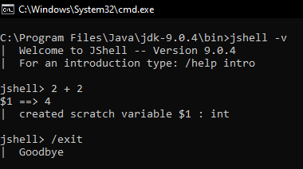

# Java 9
New features brought in by Java 9

1. **The Java Shell (JShell)**
   - REPL : Read Evaluate Print Loop
   - Useful for testing small code snippets

     

2. **The Java Platform Module System**